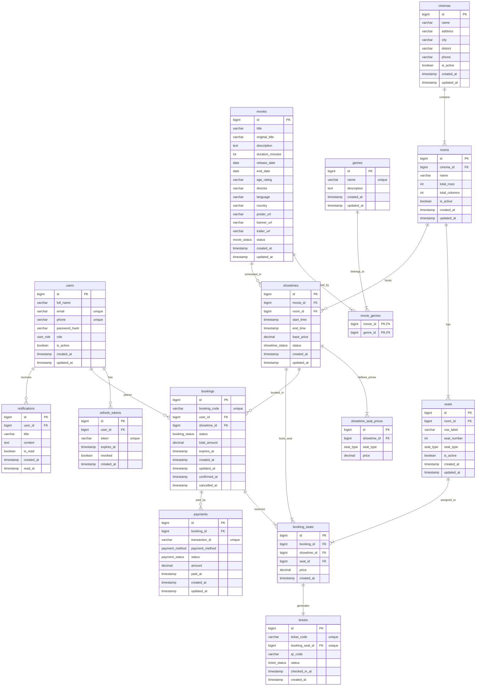

# 📊 SƠ ĐỒ THIẾT KẾ CƠ SỞ DỮ LIỆU CINEMA BOOKING SERVICE (ERD)

Tài liệu trực quan hóa toàn bộ kiến trúc cơ sở dữ liệu quan hệ của hệ thống **Cinema Booking Service**, bao gồm: **Sơ đồ Mermaid ERD**, **Định nghĩa mã nguồn DBML (dbdiagram.io)**, **Chi tiết các bảng & Khóa ngoại (Foreign Keys)**, và **Các ràng buộc toàn vẹn dữ liệu quan trọng**.

---

## 1. 🖼️ SƠ ĐỒ QUAN HỆ THỰC THỂ (MERMAID ER DIAGRAM)



---

## 2. 📋 DANH SÁCH KIỂU LIỆT KÊ (ENUM TYPES)

| Tên Enum | Giá Trị Hợp Lệ | Mô Tả Nghiệp Vụ |
| :--- | :--- | :--- |
| **`user_role`** | `USER`, `ADMIN`, `STAFF` | Phân quyền: Khách hàng, Quản trị hệ thống, Nhân viên soát vé tại rạp |
| **`movie_status`** | `COMING_SOON`, `NOW_SHOWING`, `ENDED` | Trạng thái phim: Sắp chiếu, Đang chiếu rạp, Đã ngừng chiếu |
| **`seat_type`** | `NORMAL`, `VIP`, `COUPLE` | Phân loại ghế: Ghế thường, Ghế VIP trung tâm, Ghế đôi Sweetbox |
| **`showtime_status`** | `ACTIVE`, `CANCELLED`, `FINISHED` | Trạng thái suất chiếu: Đang mở bán, Bị hủy, Đã chiếu xong |
| **`booking_status`** | `PENDING`, `CONFIRMED`, `CANCELLED`, `EXPIRED` | Đang giữ chỗ chờ thanh toán, Đã thanh toán xác nhận, Hủy, Hết hạn giữ |
| **`payment_status`** | `PENDING`, `SUCCESS`, `FAILED`, `REFUNDED` | Chờ thanh toán, Thành công, Thất bại, Hoàn tiền |
| **`payment_method`** | `CASH`, `VNPAY`, `MOMO`, `STRIPE`, `OTHER` | Tiền mặt, Ví VNPAY QR, Ví MoMo, Thẻ quốc tế Stripe / Visa / MC |
| **`ticket_status`** | `UNUSED`, `USED`, `CANCELLED` | Vé chưa quét mã vào rạp, Đã quét qua cổng, Vé bị hủy |

---

## 3. 🎯 ĐIỂM SÁNG TRONG THIẾT KẾ CƠ SỞ DỮ LIỆU NÀY

### 🛡️ 1. Chống Đặt Trùng Ghế Tuyệt Đối (Anti-Double Booking Constraint)
Bảng `booking_seats` có chỉ mục duy nhất kết hợp:
```sql
UNIQUE (showtime_id, seat_id)
```
> **Ý nghĩa:** Một ghế cụ thể trong một suất chiếu cụ thể **chỉ được phép tồn tại đúng 1 lần duy nhất** trong bảng `booking_seats`. Bất kỳ giao dịch thứ hai nào cố gắng chọn cùng ghế đó trong cùng suất chiếu sẽ bị cơ sở dữ liệu chặn ngay lập tức (Unique Constraint Violation), bảo vệ hệ thống tuyệt đối khỏi lỗi tranh chấp dữ liệu (Race Condition / Concurrency).

### 🎫 2. Tách Biệt Đơn Hàng (`bookings`) và Vé Từng Ghế (`tickets`)
- `bookings`: Đại diện cho **giao dịch tổng thể** của khách hàng (gồm 1 hoặc nhiều ghế, tổng số tiền, thời gian hết hạn giữ chỗ `expires_at`, trạng thái thanh toán).
- `tickets`: Đại diện cho **chiếc vé điện tử riêng biệt của từng ghế ngồi** (`booking_seat_id ➔ tickets 1-to-1`). Mỗi vé có một mã `ticket_code` riêng và chuỗi `qr_code` độc lập, hỗ trợ nhân viên rạp soát vé từng người khi đi theo nhóm hoặc check-in tại các thời điểm khác nhau.

### 💰 3. Bảng Giá Động Theo Suất Chiếu & Loại Ghế (`showtime_seat_prices`)
- Thay vì fix cứng giá vé vào loại ghế, bảng `showtime_seat_prices` cho phép rạp:
  - Tăng giá vé vào giờ cao điểm, cuối tuần hoặc các suất chiếu bom tấn.
  - Định nghĩa giá riêng biệt cho ghế `NORMAL`, `VIP`, `COUPLE` theo từng suất chiếu linh hoạt:
  ```sql
  UNIQUE (showtime_id, seat_type)
  ```

### 🔐 4. Xác Thực An Toàn Với Refresh Token
- Bảng `refresh_tokens` lưu trữ chuỗi token dài hạn, có cờ `revoked` và thời gian `expires_at`, cho phép người dùng duy trì đăng nhập an toàn và có thể thu hồi phiên đăng nhập khi đổi mật khẩu hoặc đăng xuất từ xa.

---

## 4. 📄 NGUYÊN BẢN DBML SCHEMA (dbdiagram.io)

Mã nguồn định dạng DBML chuẩn, có thể copy và paste trực tiếp vào [dbdiagram.io](https://dbdiagram.io/):

```dbml
// ==============================
// ENUMS
// ==============================

Enum user_role {
  USER
  ADMIN
  STAFF
}

Enum movie_status {
  COMING_SOON
  NOW_SHOWING
  ENDED
}

Enum seat_type {
  NORMAL
  VIP
  COUPLE
}

Enum showtime_status {
  ACTIVE
  CANCELLED
  FINISHED
}

Enum booking_status {
  PENDING
  CONFIRMED
  CANCELLED
  EXPIRED
}

Enum payment_status {
  PENDING
  SUCCESS
  FAILED
  REFUNDED
}

Enum payment_method {
  CASH
  VNPAY
  MOMO
  STRIPE
  OTHER
}

Enum ticket_status {
  UNUSED
  USED
  CANCELLED
}

// ==============================
// TABLES
// ==============================

Table users {
  id bigint [pk, increment]
  full_name varchar(100) [not null]
  email varchar(150) [not null, unique]
  phone varchar(20) [unique]
  password_hash varchar(255) [not null]
  role user_role [not null, default: 'USER']
  is_active boolean [not null, default: true]
  created_at timestamp [not null]
  updated_at timestamp
}

Table refresh_tokens {
  id bigint [pk, increment]
  user_id bigint [not null]
  token varchar(500) [not null, unique]
  expires_at timestamp [not null]
  revoked boolean [not null, default: false]
  created_at timestamp [not null]
}

Table genres {
  id bigint [pk, increment]
  name varchar(100) [not null, unique]
  description text
  created_at timestamp [not null]
  updated_at timestamp
}

Table movies {
  id bigint [pk, increment]
  title varchar(255) [not null]
  original_title varchar(255)
  description text
  duration_minutes int [not null]
  release_date date
  end_date date
  age_rating varchar(20)
  director varchar(150)
  language varchar(100)
  country varchar(100)
  poster_url varchar(500)
  banner_url varchar(500)
  trailer_url varchar(500)
  status movie_status [not null, default: 'COMING_SOON']
  created_at timestamp [not null]
  updated_at timestamp
}

Table movie_genres {
  movie_id bigint [not null]
  genre_id bigint [not null]

  indexes {
    (movie_id, genre_id) [pk]
  }
}

Table cinemas {
  id bigint [pk, increment]
  name varchar(255) [not null]
  address varchar(500) [not null]
  city varchar(100)
  district varchar(100)
  phone varchar(20)
  is_active boolean [not null, default: true]
  created_at timestamp [not null]
  updated_at timestamp
}

Table rooms {
  id bigint [pk, increment]
  cinema_id bigint [not null]
  name varchar(100) [not null]
  total_rows int
  total_columns int
  is_active boolean [not null, default: true]
  created_at timestamp [not null]
  updated_at timestamp

  indexes {
    (cinema_id, name) [unique]
  }
}

Table seats {
  id bigint [pk, increment]
  room_id bigint [not null]
  row_label varchar(10) [not null]
  seat_number int [not null]
  seat_type seat_type [not null, default: 'NORMAL']
  is_active boolean [not null, default: true]
  created_at timestamp [not null]
  updated_at timestamp

  indexes {
    (room_id, row_label, seat_number) [unique]
  }
}

Table showtimes {
  id bigint [pk, increment]
  movie_id bigint [not null]
  room_id bigint [not null]
  start_time timestamp [not null]
  end_time timestamp [not null]
  base_price decimal(12,2) [not null]
  status showtime_status [not null, default: 'ACTIVE']
  created_at timestamp [not null]
  updated_at timestamp

  indexes {
    movie_id
    room_id
    start_time
  }
}

Table showtime_seat_prices {
  id bigint [pk, increment]
  showtime_id bigint [not null]
  seat_type seat_type [not null]
  price decimal(12,2) [not null]

  indexes {
    (showtime_id, seat_type) [unique]
  }
}

Table bookings {
  id bigint [pk, increment]
  booking_code varchar(50) [not null, unique]
  user_id bigint [not null]
  showtime_id bigint [not null]
  status booking_status [not null, default: 'PENDING']
  total_amount decimal(12,2) [not null]
  expires_at timestamp
  created_at timestamp [not null]
  updated_at timestamp
  confirmed_at timestamp
  cancelled_at timestamp

  indexes {
    user_id
    showtime_id
    status
  }
}

Table booking_seats {
  id bigint [pk, increment]
  booking_id bigint [not null]
  showtime_id bigint [not null]
  seat_id bigint [not null]
  price decimal(12,2) [not null]
  created_at timestamp [not null]

  indexes {
    (booking_id, seat_id) [unique]
    (showtime_id, seat_id) [unique]
  }
}

Table payments {
  id bigint [pk, increment]
  booking_id bigint [not null]
  transaction_id varchar(255) [unique]
  payment_method payment_method [not null]
  status payment_status [not null, default: 'PENDING']
  amount decimal(12,2) [not null]
  paid_at timestamp
  created_at timestamp [not null]
  updated_at timestamp

  indexes {
    booking_id
    status
  }
}

Table tickets {
  id bigint [pk, increment]
  ticket_code varchar(100) [not null, unique]
  booking_seat_id bigint [not null, unique]
  qr_code varchar(500)
  status ticket_status [not null, default: 'UNUSED']
  checked_in_at timestamp
  created_at timestamp [not null]
}

Table notifications {
  id bigint [pk, increment]
  user_id bigint [not null]
  title varchar(255) [not null]
  content text [not null]
  is_read boolean [not null, default: false]
  created_at timestamp [not null]
  read_at timestamp
}

// ==============================
// RELATIONSHIPS
// ==============================

Ref: refresh_tokens.user_id > users.id
Ref: movie_genres.movie_id > movies.id
Ref: movie_genres.genre_id > genres.id
Ref: rooms.cinema_id > cinemas.id
Ref: seats.room_id > rooms.id
Ref: showtimes.movie_id > movies.id
Ref: showtimes.room_id > rooms.id
Ref: showtime_seat_prices.showtime_id > showtimes.id
Ref: bookings.user_id > users.id
Ref: bookings.showtime_id > showtimes.id
Ref: booking_seats.booking_id > bookings.id
Ref: booking_seats.showtime_id > showtimes.id
Ref: booking_seats.seat_id > seats.id
Ref: payments.booking_id > bookings.id
Ref: tickets.booking_seat_id > booking_seats.id
Ref: notifications.user_id > users.id
```
