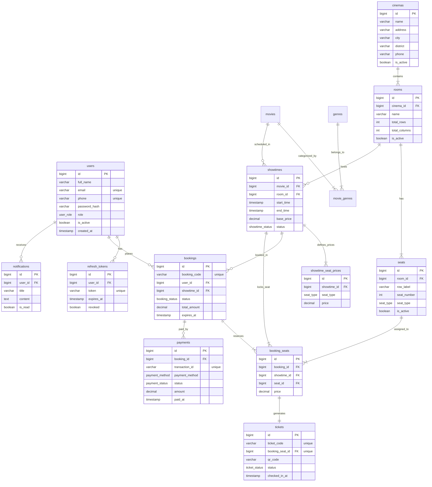

# 🚀 KẾ HOẠCH PHÁT TRIỂN HỆ THỐNG BACKEND CINEMA BOOKING SERVICE (SPRING BOOT)

Tài liệu phân tích kiến trúc hiện tại của dự án **`CinemaBookingService` (Backend)** và lộ trình phát triển toàn diện để hoàn thiện đầy đủ các API, kết nối đồng bộ 100% với giao diện **`CinemaBookingServiceFE` (Frontend CineGlow)**.

---

## 📑 MỤC LỤC
1. [Phân Tích Hiện Trạng Backend (Current Architecture Audit)](#1-phân-tích-hiện-trạng-backend)
2. [Khoảng Trống Cần Bổ Sung (Gap Analysis So Với Frontend)](#2-khoảng-trống-cần-bổ-sung-gap-analysis)
3. [Lộ Trình Phát Triển Chi Tiết Theo Giai Đoạn (Roadmap)](#3-lộ-trình-phát-triển-chi-tiết-theo-giai-đoạn)
   - [Giai đoạn 1: Cấu hình nền tảng, CORS, Bảo mật & Swagger UI](#giai-đoạn-1-cấu-hình-nền-tảng-cors-bảo-mật--swagger-ui)
   - [Giai đoạn 2: Cụm Rạp, Phòng Chiếu, Ghế Ngồi & Suất Chiếu](#giai-đoạn-2-cụm-rạp-phòng-chiếu-ghế-ngồi--suất-chiếu)
   - [Giai đoạn 3: Giữ Ghế Realtime, Đặt Vé & Xuất Mã QR](#giai-đoạn-3-giữ-ghế-realtime-đặt-vé--xuất-mã-qr)
   - [Giai đoạn 4: Bắp Nước, Voucher Khuyến Mãi & Tích Điểm VIP](#giai-đoạn-4-bắp-nước-voucher-khuyến-mãi--tích-điểm-vip)
   - [Giai đoạn 5: Cổng Thanh Toán (VNPAY/MoMo), Đánh Giá & Data Seeder](#giai-đoạn-5-cổng-thanh-toán-vnpaymomo-đánh-giá--data-seeder)
4. [Bảng Ánh Xạ API Frontend ➔ Backend (API Mapping Matrix)](#4-bảng-ánh-xạ-api-frontend--backend)
5. [Thiết Kế Cơ Sở Dữ Liệu Quan Hệ (Database Schema ERD)](#5-thiết-kế-cơ-sở-dữ-liệu-quan-hệ-database-schema)
6. [Kế Hoạch Triển Khai & Kiểm Thử (DevOps & Testing)](#6-kế-hoạch-triển-khai--kiểm-thử)

---

## 1. PHÂN TÍCH HIỆN TRẠNG BACKEND

### 1.1. Công nghệ & Ngăn xếp (Tech Stack)
* **Ngôn ngữ**: Java 21 (`--enable-preview` hỗ trợ các tính năng hiện đại).
* **Framework**: Spring Boot 4.x / Spring Framework 6.
* **Cơ sở dữ liệu**: PostgreSQL (`org.postgresql:postgresql`), Spring Data JPA, Hibernate ORM (`ddl-auto=update`).
* **Hỗ trợ lập trình**: Project Lombok, Spring Boot Starter Validation (`jakarta.validation`), Maven Compiler.
* **Cấu hình hiện tại (`application.properties`)**:
  - Tên dịch vụ: `CinemaBookingService`
  - URL Database: `jdbc:postgresql://localhost:5432/cinema_booking`
  - User/Pass: `postgres` / `123456`
  - Logging SQL: `spring.jpa.show-sql=true`

### 1.2. Kiến trúc mã nguồn (Architectural Pattern)
Backend đang được tổ chức rất chuẩn mực theo mô hình **Domain-Driven Design (DDD)** kết hợp **Hexagonal / Clean Architecture**:

```
com.example.cinemabookingservice
├── movie
│   ├── domain                     # Lõi nghiệp vụ (Domain Entities, Value Objects, Domain Repositories)
│   │   ├── Genre.java
│   │   ├── Movie.java
│   │   ├── MovieStatus.java       # COMING_SOON, NOW_SHOWING, ENDED
│   │   ├── exception/             # Domain Exceptions (MovieNotFoundException, GenreNotFoundException)
│   │   └── repository/            # Interface MovieRepository, GenreRepository
│   ├── application                # Ứng dụng & Use Cases (Application Services, DTOs, Mappers)
│   │   ├── dto/                   # CreateMovieRequest, UpdateMovieRequest, MovieResponse...
│   │   └── service/               # MovieService, GenreService
│   ├── infrastructure             # Hạ tầng & Database Adapter (JPA Entities, Spring Data Repositories)
│   │   └── persistence/
│   │       ├── entity/            # MovieEntity, GenreEntity
│   │       ├── repository/        # MovieJpaRepository, GenreJpaRepository
│   │       ├── adapter/           # MovieRepositoryImpl, GenreRepositoryImpl
│   │       └── mapper/            # MoviePersistenceMapper, GenrePersistenceMapper
│   └── presentation               # Tầng giao tiếp người dùng (REST Controllers)
│       ├── MovieController.java   # /api/movies (CRUD, Search, Filter Status, Pagination)
│       └── GenreController.java   # /api/genres (CRUD thể loại phim)
└── shared                         # Các thành phần dùng chung toàn hệ thống
    ├── response/                  # ApiResponse<T>, PageResponse<T>
    ├── pagination/                # PageRequest, PaginationUtils
    └── exception/                 # GlobalExceptionHandler, ResourceNotFoundException...
```

### 1.3. Đánh giá điểm mạnh hiện có
* **Kiến trúc rõ ràng, phân lớp chặt chẽ**: Domain Entity không bị phụ thuộc vào JPA Entity, dễ dàng bảo trì và viết Unit Test độc lập.
* **Chuẩn hóa phản hồi API**: Sử dụng `ApiResponse<T>` đồng nhất `{ success, message, data, timestamp }` rất thân thiện với Frontend `apiClient.ts`.
* **Phân trang & Tìm kiếm chuẩn**: Hỗ trợ `PageResponse<T>` kèm tìm kiếm phim và lọc theo trạng thái (`now_showing`, `coming_soon`).

---

## 2. KHOẢNG TRỐNG CẦN BỔ SUNG (GAP ANALYSIS)

So sánh với giao diện Frontend CineGlow (`CinemaBookingServiceFE`), Backend hiện tại **mới chỉ có duy nhất Module Quản lý Phim & Thể loại (`movie`)**. Để một hệ thống rạp chiếu phim vận hành thực tế, cần xây dựng thêm các module sau:

| Module còn thiếu | Vai trò trong hệ thống | Tương ứng trên Frontend |
| :--- | :--- | :--- |
| **1. CORS Configuration** | Cho phép trình duyệt gọi API từ `http://localhost:5173` | Toàn bộ các trang Frontend |
| **2. Auth & User Module** | Đăng ký, đăng nhập JWT, phân quyền Khách / Thành viên / Quản trị viên rạp | Trang Đăng nhập/Đăng ký, Header, Profile |
| **3. Cinema & Hall Module** | Quản lý danh sách cụm rạp, phòng chiếu (IMAX, 2D, 3D, Dolby Atmos) | Trang Cụm Rạp (`CinemasPage`), Trang Lịch Chiếu |
| **4. Seat & Seat Map** | Định nghĩa ma trận ghế ngồi (Standard, VIP, Couple Sweetbox Hàng J) | Bước Chọn Ghế (`SeatMap`, `BookingPage`) |
| **5. Showtime Module** | Lịch chiếu phim theo rạp, theo ngày, phòng chiếu và giá vé | Trang Lịch Chiếu (`ShowtimesPage`), Chi tiết phim |
| **6. Realtime Seat Hold & Booking** | Giữ ghế tạm thời 5-10 phút (chống trùng ghế), đặt vé & sinh mã QR | Bước Đặt vé (`BookingPage`), Vé thành công |
| **7. Concessions Module** | Menu bắp nước, combo gia đình, đặt kèm vé hoặc nhận tại quầy | Trang Bắp Nước (`ConcessionsPage`), Checkout |
| **8. Promotions & Loyalty** | Quản lý mã voucher giảm giá, tích điểm thành viên CinePoint (10%) | Trang Khuyến Mãi (`PromotionsPage`), Checkout |
| **9. Payment Integration** | Tích hợp cổng thanh toán VNPAY-QR, Ví MoMo, ZaloPay, Thẻ quốc tế | Bước Thanh toán (`CheckoutStep`) |
| **10. Movie Reviews & Ratings** | Đánh giá sao (1-10 sao), viết nhận xét, cảnh báo spoiler | Trang Chi Tiết Phim (`MovieDetailPage`) |
| **11. OpenAPI / Swagger UI** | Tài liệu hóa tự động toàn bộ API endpoint cho lập trình viên | Kiểm thử & Tích hợp nhanh |

---

## 3. LỘ TRÌNH PHÁT TRIỂN CHI TIẾT THEO GIAI ĐOẠN

```
┌────────────────────────────────────────────────────────────────────────────────────────┐
│                        LỘ TRÌNH 5 GIAI ĐOẠN PHÁT TRIỂN BACKEND                         │
├─────────────────┬─────────────────┬──────────────────┬─────────────────┬───────────────┤
│   GIAI ĐOẠN 1   │   GIAI ĐOẠN 2   │   GIAI ĐOẠN 3    │   GIAI ĐOẠN 4   │  GIAI ĐOẠN 5  │
│  Cấu Hình Nền   │ Cụm Rạp, Phòng  │  Giữ Ghế & Đặt Vé│ Bắp Nước, Mã    │ Cổng Thanh    │
│  Tảng, CORS,    │ Chiếu, Ghế Ngồi │  Thời Gian Thực  │ Giảm Giá & Tích │ Toán & Dữ Liệu│
│  Auth & Swagger │ & Suất Chiếu    │  (Lock & QR)     │ Điểm Thành Viên │ Mẫu Demo      │
└─────────────────┴─────────────────┴──────────────────┴─────────────────┴───────────────┘
```

---

### GIAI ĐOẠN 1: Cấu Hình Nền Tảng, CORS, Bảo Mật & Swagger UI
*Mục tiêu: Đảm bảo Frontend gọi được Backend qua HTTP không bị chặn CORS, có tài liệu API Swagger và hệ thống xác thực người dùng.*

1. **Cấu hình CORS (`CorsConfig.java`)**:
   - Mở quyền truy cập cho Origin `http://localhost:5173` và `http://127.0.0.1:5173`.
   - Cho phép các Header `Authorization`, `Content-Type`, và các HTTP Method (`GET`, `POST`, `PUT`, `DELETE`, `PATCH`, `OPTIONS`).
2. **Tích hợp Springdoc OpenAPI (Swagger UI)**:
   - Thêm dependency `springdoc-openapi-starter-webmvc-ui` vào `pom.xml`.
   - Truy cập giao diện trực quan tại: `http://localhost:8080/swagger-ui.html`.
3. **Module Xác Thực & Người Dùng (`com.example.cinemabookingservice.auth` & `user`)**:
   - Thêm dependency `spring-boot-starter-security` và `jjwt` (hoặc Spring Security OAuth2 Resource Server).
   - Domain: `User`, `Role` (`ROLE_CUSTOMER`, `ROLE_STAFF`, `ROLE_ADMIN`), `MembershipTier` (`STANDARD`, `VIP`, `DIAMOND`).
   - Endpoint:
     - `POST /api/auth/register`: Đăng ký tài khoản (+ tặng ngay 50 điểm CinePoint).
     - `POST /api/auth/login`: Đăng nhập trả về JWT Access Token + Refresh Token.
     - `GET /api/auth/me`: Lấy thông tin tài khoản hiện tại từ Token.
     - `PUT /api/users/profile`: Cập nhật họ tên, số điện thoại, đổi mật khẩu.

---

### GIAI ĐOẠN 2: Cụm Rạp, Phòng Chiếu, Ghế Ngồi & Suất Chiếu
*Mục tiêu: Xây dựng dữ liệu nền tảng cho mạng lưới rạp chiếu, sơ đồ phòng vé và lịch chiếu.*

1. **Module Cụm Rạp & Phòng Chiếu (`cinema`)**:
   - Entity `Cinema`: Tên rạp (ví dụ: *CineGlow Landmark 81 IMAX Laser*), thành phố, địa chỉ, hotline, tọa độ GPS, ảnh rạp.
   - Entity `Hall` (Phòng chiếu): Tên phòng (Phòng 01, Phòng IMAX Laser), loại phòng (`IMAX`, `4DX`, `DOLBY_ATMOS`, `GOLD_CLASS`, `STANDARD_2D`), tổng số ghế.
   - Entity `Seat` (Ghế ngồi):
     - Tọa độ hàng (`row`: A, B, C... J) và cột (`col`: 1..12).
     - Mã ghế: `A-01`, `F-06`, `J-01`...
     - Loại ghế (`SeatType`): `STANDARD`, `VIP` (hàng trung tâm E-H), `COUPLE` (hàng ghế đôi cuối J).
     - Ghế đôi ghép cặp: Cặp ghế `J-01 & J-02` khi chọn sẽ khóa đồng thời 2 ghế.
2. **Module Suất Chiếu (`showtime`)**:
   - Entity `Showtime`: Khóa ngoại trỏ đến `Movie` và `Hall`.
   - Ngày chiếu (`date`: `LocalDate`), Giờ chiếu (`time`: `LocalTime`).
   - Định dạng suất chiếu (`format`: `IMAX`, `3D`, `2D`).
   - Giá vé cơ sở (`basePrice`: 95.000đ - 160.000đ).
   - Endpoints:
     - `GET /api/cinemas`: Danh sách cụm rạp theo thành phố.
     - `GET /api/cinemas/{id}`: Chi tiết cụm rạp, tiện ích, phòng chiếu.
     - `GET /api/showtimes`: Lọc suất chiếu theo Phim, Rạp, Ngày chiếu, Định dạng.
     - `GET /api/showtimes/{id}/seats`: Lấy sơ đồ ghế của suất chiếu kèm trạng thái (`available`, `holding`, `sold`).

---

### GIAI ĐOẠN 3: Giữ Ghế Realtime, Đặt Vé & Xuất Mã QR
*Mục tiêu: Xử lý bài toán cốt lõi của ứng dụng rạp phim: chống tranh chấp ghế (Concurrency) và tạo vé hoàn chỉnh.*

1. **Cơ chế Khóa Ghế Tạm Thời (Seat Hold / Reservation Lock)**:
   - **Vấn đề**: Tránh trường hợp 2 khách hàng cùng bấm chọn và thanh toán cho cùng 1 ghế tại 1 thời điểm.
   - **Giải pháp**:
     - Khi người dùng chọn ghế trên `SeatMap`, client gửi request giữ ghế (`POST /api/bookings/hold-seats`).
     - Backend tạo bản ghi khóa tạm thời có thời hạn hết hạn (`expiresAt = now + 5 minutes`).
     - Hỗ trợ Redis TTL hoặc Spring `@Scheduled` dọn dẹp các ghế hết hạn 5 phút mỗi 30 giây.
     - Nếu người dùng bấm Quay lại hoặc Hủy: Gọi `POST /api/bookings/release-seats` giải phóng ghế ngay lập tức.
2. **Module Đặt Vé (`booking`)**:
   - Entity `Booking`:
     - Mã đặt vé duy nhất: `CG-` + 6 chữ số ngẫu nhiên (ví dụ `CG-918234`).
     - Khách hàng (`userId` hoặc `guestInfo`: Họ tên, SĐT, Email).
     - Suất chiếu (`showtimeId`), Cụm rạp, Phòng chiếu.
     - Danh sách ghế (`List<BookingSeat>`).
     - Danh sách bắp nước (`List<BookingConcession>`).
     - Tổng tiền vé, Giảm giá voucher, Tổng tiền thanh toán (`finalTotal`).
     - Trạng thái đơn: `PENDING_PAYMENT`, `PAID`, `CANCELLED`, `EXPIRED`.
     - Dữ liệu QR Code: Chuỗi mã hóa để quét tại cửa rạp (`CINEGLOW:CG-918234:ST-DUNE:F06,F07`).
   - Endpoints:
     - `POST /api/bookings/hold-seats`: Giữ ghế 5 phút.
     - `POST /api/bookings/release-seats`: Nhả ghế giữ.
     - `POST /api/bookings`: Tạo đơn đặt vé chính thức.
     - `GET /api/bookings/my-tickets`: Lịch sử vé đã mua của tài khoản đăng nhập.
     - `GET /api/bookings/code/{bookingCode}`: Tra cứu thông tin vé điện tử theo mã vé.

---

### GIAI ĐOẠN 4: Bắp Nước, Voucher Khuyến Mãi & Tích Điểm VIP
*Mục tiêu: Tối đa hóa doanh thu dịch vụ ẩm thực tại rạp và giữ chân khách hàng thân thiết.*

1. **Module Bắp Nước (`concession`)**:
   - Entity `ConcessionItem`: Tên món, mô tả, giá tiền, ảnh minh họa, danh mục (`combo`, `popcorn`, `drink`, `snack`), huy hiệu (`TIẾT KIỆM`, `COMBO GIA ĐÌNH`, `MÓN NÓNG`).
   - Endpoints:
     - `GET /api/concessions`: Lấy toàn bộ thực đơn theo nhóm món.
     - `POST /api/concessions/quick-order`: Tạo mã lấy bắp nước nhanh tại quầy (`POP-XXXX`).
2. **Module Khuyến Mãi & Mã Giảm Giá (`promotion`)**:
   - Entity `Voucher`: Mã code (`CINEVIP`, `GIAM20K`, `DISCOUNT50`, `VNPAY30K`), mức giảm (số tiền cố định hoặc %), giá trị đơn hàng tối thiểu, ngày bắt đầu, ngày kết thúc, số lượng giới hạn.
   - Endpoints:
     - `GET /api/promotions`: Danh sách các chương trình khuyến mãi hiện có.
     - `POST /api/promotions/validate`: Kiểm tra và tính toán số tiền giảm trừ cho đơn hàng.
3. **Module Điểm Thưởng & Khách Hàng Thân Thiết (`loyalty`)**:
   - Khi đơn đặt vé chuyển sang trạng thái `PAID`:
     - Tự động tích lũy **10% giá trị đơn hàng** thành điểm CinePoint (ví dụ đơn 439.000đ ➔ +44 điểm).
     - Tự động nâng hạng thành viên khi đạt mốc: *Standard (0-299đ)* ➔ *VIP (300-799đ)* ➔ *Diamond (800đ+)*.

---

### GIAI ĐOẠN 5: Cổng Thanh Toán (VNPAY/MoMo), Đánh Giá & Data Seeder
*Mục tiêu: Hoàn tất luồng thanh toán thực tế và nạp sẵn dữ liệu mẫu để sẵn sàng nghiệm thu.*

1. **Module Thanh Toán (`payment`)**:
   - Tích hợp VNPAY Sandbox & MoMo Payment Gateway:
     - `POST /api/payments/create-url`: Khởi tạo liên kết thanh toán chuyển hướng hoặc mã QR thanh toán động.
     - `GET /api/payments/vnpay-return`: URL trả về sau khi khách hàng hoàn tất thanh toán trên cổng.
     - `POST /api/payments/vnpay-ipn`: Webhook xác nhận giao dịch ngầm giữa VNPAY Server và Backend.
2. **Module Đánh Giá & Bình Luận Phim (`review`)**:
   - Entity `MovieReview`: Người đánh giá, phim, số sao (1-10 sao), tiêu đề, nội dung nhận xét, cờ `isSpoiler`, số lượt thích (helpful).
   - Tự động tính toán lại `rating` trung bình và `voteCount` của phim sau mỗi lượt đánh giá mới.
   - Endpoints:
     - `GET /api/movies/{id}/reviews`: Danh sách bình luận phim kèm lọc và sắp xếp.
     - `POST /api/movies/{id}/reviews`: Gửi đánh giá mới.
3. **Tự Động Nạp Dữ Liệu Mẫu (Database Seeder / `DataInitializer`)**:
   - Viết `CommandLineRunner` tự động kiểm tra database khi ứng dụng khởi động:
     - Nếu database trống: Tự động nạp 8 bộ phim bom tấn (*Dune 2, Mai, Exhuma, Kung Fu Panda 4, Godzilla x Kong...*), 6 cụm rạp (*Landmark 81, Đồng Khởi, Thảo Điền...*), đầy đủ ma trận 9 hàng ghế x 12 cột, menu 6 món bắp nước, 4 mã voucher và tài khoản mẫu `maitrinh@cineglow.vn / 123456`.
     - Giúp hệ thống hoạt động ngay lập tức mà không cần nhập tay từng dữ liệu!

---

## 4. BẢNG ÁNH XẠ API FRONTEND ➔ BACKEND (API MAPPING MATRIX)

Frontend `CinemaBookingServiceFE/src/services/` đã được viết sẵn để kết nối tới các endpoint này:

| Tính Năng Frontend | File Service Frontend | HTTP Method | Endpoint Backend Đề Xuất |
| :--- | :--- | :--- | :--- |
| **Đăng nhập tài khoản** | `authService.ts` | `POST` | `/api/auth/login` |
| **Đăng ký tài khoản** | `authService.ts` | `POST` | `/api/auth/register` |
| **Lấy hồ sơ người dùng** | `authService.ts` | `GET` | `/api/auth/me` |
| **Cập nhật thông tin cá nhân**| `authService.ts` | `PUT` | `/api/users/profile` |
| **Lấy danh sách phim** | `movieService.ts` | `GET` | `/api/movies?page=0&size=10&status=now_showing` |
| **Chi tiết một bộ phim** | `movieService.ts` | `GET` | `/api/movies/{id}` |
| **Danh sách cụm rạp** | `movieService.ts` | `GET` | `/api/cinemas` |
| **Lịch chiếu theo phim/rạp** | `movieService.ts` | `GET` | `/api/showtimes?movieId={id}&date={date}` |
| **Sơ đồ ghế của suất chiếu** | `bookingService.ts`| `GET` | `/api/showtimes/{id}/seats` |
| **Khóa ghế tạm thời 5 phút** | `bookingService.ts`| `POST`| `/api/bookings/hold-seats` |
| **Hủy khóa ghế** | `bookingService.ts`| `POST`| `/api/bookings/release-seats` |
| **Tạo đơn đặt vé** | `bookingService.ts`| `POST`| `/api/bookings` |
| **Lịch sử vé đã mua** | `bookingService.ts`| `GET` | `/api/bookings/my-tickets` |
| **Tra cứu vé theo mã** | `bookingService.ts`| `GET` | `/api/bookings/code/{bookingCode}` |
| **Thực đơn bắp nước** | `concessionService.ts`| `GET` | `/api/concessions` |
| **Kiểm tra mã giảm giá** | `paymentService.ts`| `POST`| `/api/promotions/validate` |
| **Khởi tạo thanh toán QR** | `paymentService.ts`| `POST`| `/api/payments/create-url` |
| **Xác thực kết quả thanh toán**| `paymentService.ts`| `GET` | `/api/payments/verify?transactionId=...` |
| **Gửi đánh giá nhận xét phim**| `movieService.ts` | `POST`| `/api/movies/{id}/reviews` |

---

## 5. THIẾT KẾ CƠ SỞ DỮ LIỆU QUAN HỆ (DATABASE SCHEMA)

> 💡 **Chi tiết đầy đủ:** Xem tại tệp [`DATABASE_SCHEMA.md`](file:///d:/MaiTrinh/Dev/CinemaBookingService/DATABASE_SCHEMA.md) trong thư mục Backend (chứa mã nguồn DBML gốc của dbdiagram.io và định nghĩa chi tiết các bảng).



---

## 6. KẾ HOẠCH TRIỂN KHAI & KIỂM THỬ

### Bước 1: Chuẩn Bị & Cấu Hình Kết Nối (Ngay lập tức)
1. Thêm cấu hình CORS trong `com.example.cinemabookingservice.shared.config.CorsConfig` để Frontend gọi API mà không bị chặn.
2. Thêm thư viện `springdoc-openapi-starter-webmvc-ui` vào `pom.xml` để mở Swagger UI.
3. Đảm bảo dịch vụ PostgreSQL đang chạy hoặc tạo file `docker-compose.yml` để chạy PostgreSQL chỉ với lệnh `docker compose up -d`.

### Bước 2: Triển khai Module Cinema, Hall, Seat & Showtime (Ưu tiên số 1)
1. Tạo domain & infrastructure cho `Cinema`, `Hall`, `Seat`.
2. Tạo logic tự động khởi tạo ma trận ghế (108 ghế / phòng với ghế Standard, VIP và Sweetbox).
3. Tạo module `Showtime` và viết API trả về danh sách suất chiếu & sơ đồ ghế.

### Bước 3: Triển khai Module Đặt vé & Giữ ghế Realtime (Ưu tiên số 2)
1. Viết cơ chế khóa ghế 5 phút (`hold-seats`).
2. Viết API tạo đơn vé (`bookings`) và lưu trạng thái vào PostgreSQL.

### Bước 4: Triển khai Auth, Bắp nước, Khuyến mãi & Thanh toán (Ưu tiên số 3)
1. Tích hợp Spring Security & JWT cho tài khoản người dùng.
2. Cung cấp API bắp nước, mã giảm giá và tính điểm CinePoint.
3. Viết bộ Data Seeder nạp dữ liệu mẫu hoàn hảo.

### Bước 5: Kiểm thử liên thông End-to-End (E2E Integration Test)
1. Khởi chạy Backend tại cổng `http://localhost:8080`.
2. Chuyển cấu hình `API_BASE_URL` trong Frontend `apiClient.ts` về `http://localhost:8080/api`.
3. Kiểm thử luồng trọn vẹn trên trình duyệt: Đăng ký ➔ Đăng nhập ➔ Chọn phim ➔ Chọn rạp & suất chiếu ➔ Chọn ghế ➔ Chọn bắp nước ➔ Áp mã giảm giá ➔ Thanh toán ➔ Xuất vé điện tử QR Code.
