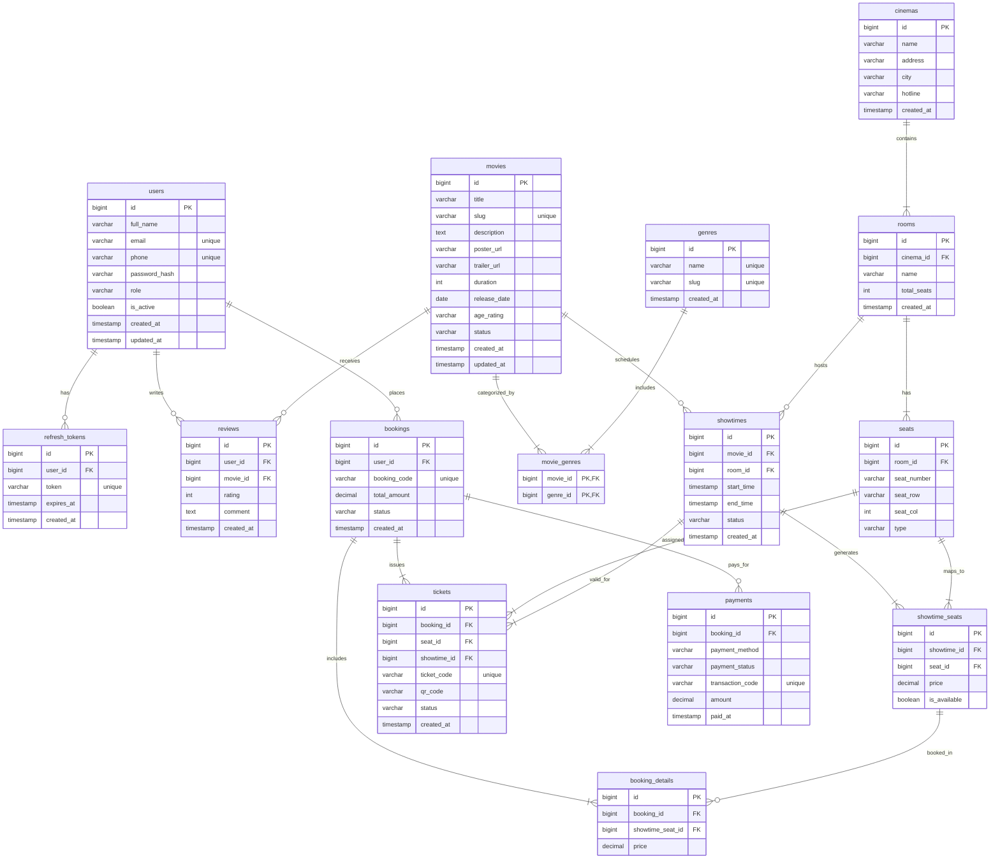

# 🎬 CineGlow - Cinema Booking System

[](https://openjdk.org/)
[](https://spring.io/projects/spring-boot)
[](https://react.dev/)
[](https://www.typescriptlang.org/)
[](https://vitejs.dev/)
[](https://www.postgresql.org/)
[](https://www.docker.com/)

Hệ thống đặt vé xem phim trực tuyến hiện đại, tốc độ cao được xây dựng theo mô hình **Monorepo** bao gồm **Backend (Spring Boot)** và **Frontend (React TypeScript)**.

---

## 📁 Cấu trúc thư mục (Monorepo Layout)

```text
CinemaBookingSystem/
├── backend/                   # Spring Boot 3 (Clean Architecture / DDD-lite)
│   ├── src/main/java/         # Domain, Application, Infrastructure, Presentation
│   ├── src/main/resources/    # Cấu hình DB, JPA, Liquibase/Flyway
│   ├── pom.xml                # Quản lý Maven dependencies
│   └── mvnw / mvnw.cmd        # Maven Wrapper
│
├── frontend/                  # React 18 + Vite + TypeScript
│   ├── src/components/        # SeatMap, ETicketCard, HeroSlider, Header, Modals...
│   ├── src/pages/             # Home, Movies, Showtimes, Booking, Profile...
│   ├── src/services/          # API Client kết nối Backend (Axios, JWT interceptors)
│   ├── src/contexts/          # AuthContext, ThemeContext, ToastContext
│   ├── package.json           # Scripts & dependencies
│   └── vite.config.ts         # Vite build configuration
│
├── docker-compose.yml         # Khởi tạo PostgreSQL 16 & pgAdmin 4 local
├── DATABASE_SCHEMA.md         # Chi tiết sơ đồ cơ sở dữ liệu & mã DBML
├── KE_HOACH_PHAT_TRIEN.md     # Kế hoạch và Roadmap phát triển chi tiết
├── .gitignore                 # Bỏ qua node_modules, target, .idea, logs
└── README.md                  # Tài liệu giới thiệu hệ thống
```

---

## 🗄️ Sơ đồ cơ sở dữ liệu (Database ERD)

GitHub tự động hiển thị sơ đồ quan hệ thực thể (ERD) bên dưới:



> Chi tiết toàn bộ kiểu dữ liệu và mã DBML xem tại [DATABASE_SCHEMA.md](./DATABASE_SCHEMA.md).

---

## 🚀 Hướng dẫn khởi chạy (Quick Start)

### 1. Yêu cầu môi trường
- **Java**: OpenJDK 21 hoặc mới hơn
- **Node.js**: v18.x hoặc v20.x trở lên (kèm npm)
- **Docker & Docker Compose** (khuyên dùng để chạy nhanh Database)

---

### 2. Khởi động Cơ sở dữ liệu PostgreSQL
Khởi chạy container PostgreSQL 16 và pgAdmin:
```bash
docker compose up -d
```
- **PostgreSQL**: `localhost:5432` (User: `cinema_user`, Password: `cinema_password`, DB: `cinema_booking_db`)
- **pgAdmin**: Truy cập `http://localhost:5050` (Email: `admin@cinema.com`, Password: `admin`)

---

### 3. Khởi chạy Backend (Spring Boot)
Di chuyển vào thư mục `backend`:
```bash
cd backend
```
Chạy ứng dụng với Maven Wrapper:
```bash
# Trên Windows
.\mvnw.cmd spring-boot:run

# Trên Linux / macOS
./mvnw spring-boot:run
```
- Backend sẽ chạy tại: `http://localhost:8080`
- API Health Check: `http://localhost:8080/api/movies`

---

### 4. Khởi chạy Frontend (React Vite)
Mở một terminal mới và di chuyển vào thư mục `frontend`:
```bash
cd frontend

# Cài đặt thư viện
npm install

# Khởi chạy môi trường phát triển (Dev server)
npm run dev
```
- Truy cập giao diện ứng dụng tại: `http://localhost:5173`

---

## ✨ Tính năng nổi bật

- 🎬 **Trình duyệt phim đa dạng**: Phim đang chiếu, sắp chiếu, tìm kiếm tức thì, bộ lọc theo thể loại và rạp.
- 💺 **Sơ đồ chọn ghế tương tác thời gian thực**: Ghế thường, ghế VIP, ghế đôi Sweetbox với màn hình cong sống động và bảng chú thích trực quan.
- 🍿 **Combo Bắp Nước (Concessions)**: Tích hợp chọn combo bỏng nước kèm ưu đãi trước khi thanh toán.
- 💳 **Thanh toán đa phương thức**: Sẵn sàng tích hợp cổng VNPay, MoMo, Thẻ tín dụng/ghi nợ.
- 🎟️ **Vé điện tử (E-Ticket) & Mã QR**: Sinh vé điện tử tức thì kèm mã QR, hỗ trợ xuất và tải ảnh vé chất lượng cao.
- 🎨 **Đa dạng giao diện (4 Themes)**: Midnight Velvet (mặc định cao cấp), Cyberpunk Neon, Classic Dark, và Pearl Light.
- 📱 **Mobile-First & Responsive hoàn hảo**: Tối ưu mượt mà cho mọi kích thước màn hình từ điện thoại (390px) đến tablet và desktop.
- 🔔 **Hệ thống thông báo Toast cao cấp**: Cung cấp phản hồi người dùng tức thì khi đăng nhập, giữ ghế, thanh toán và hủy vé.

---

## 🛠️ Công nghệ sử dụng

| Phân hệ | Công nghệ |
| :--- | :--- |
| **Backend** | Java 21, Spring Boot 3, Spring Data JPA, Hibernate, PostgreSQL, Clean Architecture |
| **Frontend** | React 18, Vite 5, TypeScript 5, React Router DOM, Canvas Confetti, Vanilla CSS Tokens |
| **DevOps** | Docker, Docker Compose, Git Monorepo |

---

## 📄 License & Tác giả
Dự án được phát triển phục vụ mục đích học tập và xây dựng hệ thống rạp chiếu phim chuyên nghiệp.
