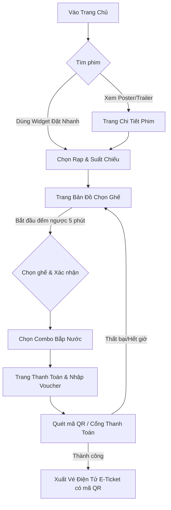
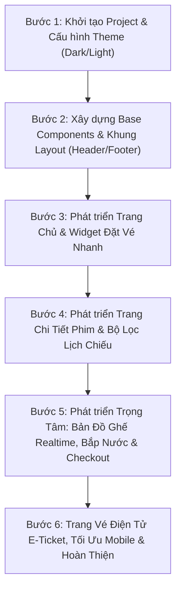

# 🎬 KẾ HOẠCH TRIỂN KHAI & THIẾT KẾ FRONTEND CHO HỆ THỐNG ĐẶT VÉ XEM PHIM (CINEMA BOOKING)

Tài liệu này cung cấp bức tranh toàn diện về: **Kế hoạch triển khai**, **Công nghệ sử dụng**, **Hệ thống giao diện (Theme & Design System)** và **Cấu trúc các màn hình (Templates & Wireframes)** cho dự án website đặt vé xem phim trực tuyến hiện đại, chuẩn rạp chiếu phim cao cấp.

---

## 📑 MỤC LỤC
1. [Tổng quan dự án & Mục tiêu UX/UI](#1-tổng-quan-dự-án--mục-tiêu-uxui)
2. [Ngăn xếp công nghệ đề xuất (Tech Stack)](#2-ngăn-xếp-công-nghệ-đề-xuất-tech-stack)
3. [Chủ đề & Hệ thống nhận diện (Theme & Design System)](#3-chủ-đề--hệ-thống-nhận-diện-theme--design-system)
4. [Cấu trúc màn hình & Thiết kế Wireframes (Templates)](#4-cấu-trúc-màn-hình--thiết-kế-wireframes-templates)
5. [Quy trình đặt vé người dùng (User Flow)](#5-quy-trình-đặt-vé-người-dùng-user-flow)
6. [Lộ trình triển khai chi tiết (Roadmap)](#6-lộ-trình-triển-khai-chi-tiết-roadmap)
7. [Kiến trúc thư mục mã nguồn dự án](#7-kiến-trúc-thư-mục-mã-nguồn-dự-án)
8. [Quy trình & Thứ tự các bước triển khai giao diện](#8-quy-trình--thứ-tự-các-bước-triển-khai-giao-diện-step-by-step-frontend-execution)

---

## 1. TỔNG QUAN DỰ ÁN & MỤC TIÊU UX/UI

### 1.1. Mục tiêu sản phẩm
Xây dựng giao diện web đặt vé xem phim mượt mà, trực quan, đậm chất điện ảnh, cạnh tranh trải nghiệm trực tiếp với các cụm rạp lớn (CGV, Lotte, Beta, BHD, Galaxy). Người dùng có thể tìm phim, chọn suất chiếu, chọn ghế trực quan theo thời gian thực và thanh toán hoàn tất chỉ trong vòng **dưới 2 phút**.

### 1.2. Tiêu chuẩn trải nghiệm (UX Principles)
* **Visual Wow**: Đậm chất rạp chiếu (Cinematic Dark Mode), hiệu ứng ánh sáng đèn neon, poster nổi bật, trailer trình phát mượt.
* **Fast & Frictionless**: Tối giản số bước đặt vé; hỗ trợ widget đặt vé nhanh ngay tại Trang chủ.
* **Realtime Seat Booking**: Bản đồ ghế phản hồi tức thì, hiển thị trạng thái giữ chỗ (countdown timer) và phân loại ghế rõ ràng.
* **Mobile-First & Responsive**: Tối ưu hoàn hảo trên điện thoại di động và máy tính bảng.

---

## 2. NGÂN XẾP CÔNG NGHỆ ĐỀ XUẤT (TECH STACK)

| Tầng công nghệ | Lựa chọn đề xuất | Lý do & Lợi ích |
| :--- | :--- | :--- |
| **Core Framework** | **React 18+ với Vite & TypeScript** *(hoặc Next.js 14 App Router)* | Tốc độ build siêu nhanh, hỗ trợ type-safety chặt chẽ cho dữ liệu vé, suất chiếu và phòng vé. |
| **Styling & Design System** | **Tailwind CSS + Shadcn UI** *(kết hợp Lucide Icons)* | Dễ dàng tùy biến theme điện ảnh (Dark/Neon), giao diện linh hoạt, tinh tế và đồng bộ. |
| **Chế độ Giao diện (Theme)** | **Tailwind `class` strategy + CSS Variables** *(ThemeContext / `useTheme`)* | Hỗ trợ chuyển đổi **Tối (Dark) / Sáng (Light) / Theo hệ thống (System)** mượt mà, lưu `localStorage`, chống giật màn hình (No-FOUC). |
| **Quản lý trạng thái (State)** | **Zustand** | Quản lý state luồng đặt vé (ghế đang chọn, combo bắp nước, mã giảm giá, đếm ngược thời gian) đơn giản, hiệu năng cao hơn Redux. |
| **Data Fetching & Cache** | **TanStack Query (React Query v5)** | Cache danh sách phim, suất chiếu, tự động polling / refetch trạng thái ghế đã đặt. |
| **Hiệu ứng & Chuyển cảnh** | **Framer Motion** | Micro-interactions mượt mà: lật thẻ poster, zoom bản đồ ghế, hiệu ứng xoay icon Sun/Moon khi đổi theme. |
| **Form & Validation** | **React Hook Form + Zod** | Xử lý form thông tin thanh toán, mã khuyến mãi, validation nhanh chóng và an toàn. |
| **Thanh toán & Realtime** | **Socket.io-client** *(giữ ghế realtime)* + **QR Code / Cổng thanh toán (VNPay, MoMo)** | Cập nhật ghế đang có người chọn theo thời gian thực và hiển thị mã QR vé điện tử. |

---

## 3. CHỦ ĐỀ & HỆ THỐNG NHẬN DIỆN (THEME & DESIGN SYSTEM)

### 3.1. Phong cách chủ đạo: Đa chế độ "Cinematic Neo-Dark" & "Modern Studio Light"
Hệ thống hỗ trợ chuyển đổi linh hoạt giữa hai giao diện nhằm phục vụ mọi hoàn cảnh sử dụng của người dùng:
* **Chế độ Tối (Dark Mode - Mặc định)**: Mang đến không gian rạp phim sống động, ánh đèn neon huyền ảo, làm nổi bật poster và trailer phim, thân thiện với mắt khi lướt web vào ban đêm.
* **Chế độ Sáng (Light Mode)**: Mang phong cách phòng vé hiện đại (*Modern Studio Cinema*), sáng sủa, thanh lịch, nền trắng ngọc trai, độ tương phản cao, tối ưu khi dùng ngoài trời hoặc ban ngày.
* **Chế độ Tự động (System)**: Tự động phát hiện và đồng bộ theo cài đặt giao diện của hệ điều hành người dùng (`prefers-color-scheme`).

```
┌────────────────────────────────────────────────────────────────────────────────────────┐
│  BẢNG SO SÁNH MÀU SẮC (DARK MODE vs LIGHT MODE DUAL PALETTE)                           │
├──────────────────────┬───────────────────────────────┬─────────────────────────────────┤
│ THÀNH PHẦN GIAO DIỆN │ CHẾ ĐỘ TỐI (RICH CHARCOAL)    │ CHẾ ĐỘ SÁNG (LIGHT MODE)        │
├──────────────────────┼───────────────────────────────┼─────────────────────────────────┤
│ Background Nền chính │ #101113 (Rich Charcoal)       │ #F8FAFC (Slate-50 / Clean Off)  │
│ Surface / Card Nền   │ #191A1D (Dark Surface)        │ #FFFFFF (Pure White + Soft Box) │
│ Surface Elevated     │ #222428 (Card / Modal)        │ #F1F5F9 (Slate-100)             │
│ Border / Đường viền  │ rgba(255, 255, 255, 0.08)     │ #E2E8F0 (Slate-200)             │
│ Primary Accent       │ #D92D20 (Cinema Red)          │ #D92D20 (Cinema Red)           │
│ Primary Hover        │ #B42318 (Deep Red)            │ #B42318 (Deep Red)             │
│ Secondary / Gold VIP │ #C8923E (Muted Gold VIP)      │ #B8863B (Warm Gold Light)      │
│ Logo                 │ #D92D20                       │ #C92A21                         │
│ Logo text            │ #F2F4F7                       │ #18181B                         │
│ VIP accent           │ #C8923E                       │ #B8863B                         │
│ Text Tiêu đề / Chính │ #F2F4F7 (Light Gray / White)  │ #0F172A (Slate-900 Đen tuyền)   │
│ Text Phụ / Secondary │ #98A2B3 (Neutral Gray)        │ #64748B (Slate-500)             │
│ Text Muted           │ #667085 (Muted Slate)         │ #94A3B8 (Slate-400)             │
│ Hiệu ứng đổ bóng     │ Glow phát sáng Cinema         │ Soft Shadow: 0 4px 20px -2px... │
└──────────────────────┴───────────────────────────────┴─────────────────────────────────┘
```

### 3.2. Cơ chế chuyển đổi giao diện (Theme Switcher Mechanism)
* **Trạng thái lưu trữ**: Lưu lựa chọn người dùng vào `localStorage.getItem('cinema_theme')` (`'dark' | 'light' | 'system'`).
* **Kỹ thuật chống chớp nháy (Anti-FOUC Script)**: Chèn inline script tại `index.html` kiểm tra theme ngay trước khi React render để màn hình không bị chớp trắng/đen khi F5.
* **Hiệu ứng chuyển đổi (Transition Animation)**: Sử dụng CSS `transition: background-color 0.3s ease, color 0.3s ease` và Framer Motion xoay đổi 180° giữa icon Mặt Trời ☀️ và Mặt Trăng 🌙.

### 3.3. Bảng phân loại màu sắc bản đồ ghế theo từng Theme (Seat Status Matrix)

| Loại Ghế | Trạng thái ở Dark Mode | Trạng thái ở Light Mode | Ý nghĩa |
| :--- | :--- | :--- | :--- |
| **Ghế Thường** | Nền `#1E293B`, Viền `#475569` | Nền `#F1F5F9`, Viền `#CBD5E1` | Ghế tiêu chuẩn hàng trước/hai bên |
| **Ghế VIP** | Nền `#78350F`, Viền `#F5C518` (Vàng óng) | Nền `#FEF3C7`, Viền `#D97706` (Hổ phách) | Khu vực trung tâm xem tốt nhất |
| **Ghế Đôi (Sweetbox)**| Nền `#831843`, Viền `#F43F5E` (Hồng neon)| Nền `#FFE4E6`, Viền `#E11D48` (Hồng ruby) | Hàng ghế cuối dành cho 2 người |
| **Ghế Đang Chọn** | Nền `#0284C7`, Viền `#00E5FF` (Glow xanh) | Nền `#0284C7`, Viền `#0284C7` (Chữ trắng) | Ghế người dùng vừa bấm chọn |
| **Ghế Đã Bán (Sold)** | Nền `#0F172A`, Icon `✖` xám mờ `#475569` | Nền `#E2E8F0`, Icon `✖` xám nhạt `#94A3B8` | Đã có người mua, vô hiệu hoá click |

### 3.4. Typography & Iconography
* **Font chữ**: `Plus Jakarta Sans` hoặc `Be Vietnam Pro` (tối ưu hiển thị tiếng Việt sắc nét, phong cách hiện đại).
* **Font tiêu đề (Display)**: `Cabinet Grotesk` hoặc `Montserrat Bold` cho tựa đề phim và con số hiển thị.
* **Bộ Icon**: `Lucide React` (Ghế cinema, vé ticket, popcorn, clock, calendar, star, play, **Sun ☀️, Moon 🌙, Monitor 💻**).

---

## 4. CẤU TRÚC MÀN HÌNH & THIẾT KẾ WIREFRAMES (TEMPLATES)

### 4.1. Header & Navigation (Thanh điều hướng cố định)
* **Bên trái**: Logo thương hiệu (hiệu ứng đèn neon ở Dark mode / Logo sắc nét ở Light mode), Chọn Tỉnh/Thành phố (Modal chọn Hà Nội, TP.HCM, Đà Nẵng,...).
* **Ở giữa**: Menu chính: *Phim chiếu*, *Cụm rạp*, *Lịch chiếu*, *Khuyến mãi*, *Bắp nước*.
* **Bên phải**: 
  * Thanh tìm kiếm nhanh (Search gợi ý theo tên phim/diễn viên).
  * **Nút chuyển đổi Giao diện Tối / Sáng (Dark/Light Switch Button)**: Icon Mặt Trời ☀️ / Mặt Trăng 🌙 với tooltip chuyển nhanh hoặc dropdown menu (*Sáng*, *Tối*, *Theo hệ thống*).
  * Nút đổi ngôn ngữ (VI / EN).
  * Nút Đăng nhập / Avatar thành viên.

---

### 4.2. Trang Chủ (Home Page Template)
Trang mặt tiền tạo ấn tượng mạnh mẽ ngay từ 3 giây đầu tiên:

```
┌────────────────────────────────────────────────────────────────────────┐
│ [HEADER: LOGO | VỊ TRÍ ▾ | MENU | TÌM KIẾM 🔍 | ☀️/🌙 | ĐĂNG NHẬP]            │
├────────────────────────────────────────────────────────────────────────┤
│ [HERO BANNER SLIDER: TRAILER PHIM BOM TẤN + NÚT "ĐẶT VÉ NGAY" & "XEM"] │
├────────────────────────────────────────────────────────────────────────┤
│ [QUICK BOOKING WIDGET (Thanh đặt vé nhanh 4 bước)]:                    │
│ 1. Chọn Phim ▾  | 2. Chọn Rạp ▾ | 3. Chọn Ngày ▾ | 4. Suất ▾ | [MUA VÉ]│
├────────────────────────────────────────────────────────────────────────┤
│ TAB SELECTION:  [🔥 PHIM ĐANG CHIẾU]   [🎬 PHIM SẮP CHIẾU]   [⭐ SUẤT ĐẶC BIỆT]  │
│                                                                        │
│ ┌──────────────┐  ┌──────────────┐  ┌──────────────┐  ┌──────────────┐ │
│ │ [POSTER 1]   │  │ [POSTER 2]   │  │ [POSTER 3]   │  │ [POSTER 4]   │ │
│ │ DUNE: PART 2 │  │ KUNG FU P. 4 │  │ MAI          │  │ GODZILLA X K │ │
│ │ ⭐ 8.8 | 166p│  │ ⭐ 7.9 | 94p │  │ ⭐ 8.2 | 131p│  │ ⭐ 7.6 | 115p│ │
│ │ [ ĐẶT VÉ ]   │  │ [ ĐẶT VÉ ]   │  │ [ ĐẶT VÉ ]   │  │ [ ĐẶT VÉ ]   │ │
│ └──────────────┘  └──────────────┘  └──────────────┘  └──────────────┘ │
├────────────────────────────────────────────────────────────────────────┤
│ KHUYẾN MÃI HOT & THÀNH VIÊN VIP (CAROUSEL BANNER ƯU ĐÃI)               │
├────────────────────────────────────────────────────────────────────────┤
│ DANH SÁCH CỤM RẠP GẦN BẠN & TRẢI NGHIỆM ĐẲNG CẤP (IMAX, 4DX, GOLDCLASS)│
├────────────────────────────────────────────────────────────────────────┤
│ [FOOTER: THÔNG TIN RẠP, CHÍNH SÁCH, HOTLINE, APP DOWNLOAD, SOCIALS]   │
└────────────────────────────────────────────────────────────────────────┘
```

---

### 4.3. Trang Chi Tiết Phim & Chọn Lịch Chiếu (Movie Details & Showtimes)
* **Phần Hero Backdrop**: Hình nền cảnh phim độ phân giải cao có lớp gradient đen phủ mờ.
* **Thông tin phim**:
  * Tựa phim (Việt - Anh), Thẻ độ tuổi (`T18`, `T16`, `P`), Định dạng (`2D`, `3D`, `IMAX`).
  * Thời lượng, Điểm đánh giá (IMDb, Rotten Tomatoes, Người dùng chấm), Đạo diễn, Dàn diễn viên.
  * Nút phát Popup Trailer (Youtube Modal player).
  * Tóm tắt nội dung phim (Synopsis).
* **Lưới lịch chiếu thông minh (Interactive Showtime Selector)**:
  * Thanh chọn ngày chiếu (Dạng trượt ngang: *Hôm nay 10/09*, *Thứ 5 11/09*,...).
  * Lọc theo cụm rạp yêu thích hoặc theo khoảng cách địa lý.
  * Phân nhóm theo phòng chiếu: **Phòng Thường 2D**, **Phòng VIP 2D**, **IMAX Laser**.
  * Các khung giờ chiếu dạng Chip bấm: `09:30`, `12:15`, `15:40`, `18:30`, `21:00` (kèm số lượng ghế còn trống).

---

### 4.4. Trang Chọn Ghế (Seat Booking Interactive Canvas) - *Tính năng trọng tâm*
Đây là màn hình quyết định tỷ lệ chuyển đổi và trải nghiệm của người dùng:

```
┌─────────────────────────────────────────────────────────────────────────┐
│ ◀ Quay lại | Phim: DUNE: PART 2 (2D Phụ đề) | Rạp: CGV Vincom - Rạp 3   │
│ ⏱ Thời gian giữ vé còn lại: [ 04:59 ]                                   │
├─────────────────────────────────────────────────────────────────────────┤
│                                                                         │
│                    /‾‾‾‾‾‾‾‾‾‾‾‾‾‾‾‾‾‾‾‾‾‾‾‾‾‾‾‾‾‾‾\                    │
│                   /          MÀN HÌNH CHIẾU         \                   │
│                  '───────────────────────────────────'                  │
│                     (Hiệu ứng ánh sáng rọi xuống)                       │
│                                                                         │
│     A  [01][02]  [03][04][05][06][07][08]  [09][10]                     │
│     B  [01][02]  [03][04][05][06][07][08]  [09][10]  (Ghế Thường)       │
│     C  [01][02]  [03][04][05][06][07][08]  [09][10]                     │
│                                                                         │
│     D  [01][02]  [★03][★04][★05][★06][★07][★08]  [09][10]               │
│     E  [01][02]  [★03][★04][✓05][✓06][★07][★08]  [09][10] (Ghế VIP)    │
│     F  [01][02]  [★03][★04][★05][★06][★07][★08]  [09][10]               │
│                                                                         │
│     H  [══ 01-02 ══]    [══ 03-04 ══]    [══ 05-06 ══]  (Ghế Đôi)       │
│                                                                         │
│ ─────────────────────────────────────────────────────────────────────── │
│ CHÚ THÍCH:                                                              │
│ [ ] Trống   [✓] Đang chọn   [★] Ghế VIP   [══] Ghế đôi   [✖] Đã bán     │
├─────────────────────────────────────────────────────────────────────────┤
│ THANH TỔNG KẾT GHẾ CỐ ĐỊNH (BOTTOM BAR):                                │
│ Ghế đã chọn: E05, E06 (VIP) | Tạm tính: 220.000 đ    [ TIẾP TỤC BẮP NƯỚC ➔ ] │
└─────────────────────────────────────────────────────────────────────────┘
```

---

### 4.5. Trang Chọn Bắp Nước & Combo (F&B Concession)
* Hiển thị danh mục Combo (My Combo, Couple Combo, Party Combo, Ly nhân vật giới hạn).
* Thẻ hình ảnh sắc nét, tên sản phẩm, chi tiết thành phần (1 bắp ngọt lớn + 2 nước ngọt 32oz).
* Bộ đếm tăng/giảm số lượng (+ / -) kèm tự động cập nhật tổng tiền.
* Nút "Bỏ qua bước này" nếu người dùng không có nhu cầu ăn uống.

---

### 4.6. Trang Thanh Toán & Tổng Hợp Vé (Checkout Page)
* **Cột trái**:
  * Phương thức thanh toán: Ví MoMo, ZaloPay, Cổng VNPAY (Quét QR), Thẻ ATM nội địa, Thẻ quốc tế Visa/MasterCard.
  * Form nhập mã giảm giá / Voucher khuyến mãi / Điểm tích lũy thành viên.
  * Thông tin nhận vé: Email & Số điện thoại (gửi vé điện tử SMS & Email).
* **Cột phải (Hóa đơn tóm tắt)**:
  * Poster nhỏ + Tên phim, định dạng.
  * Rạp, phòng chiếu, ngày & suất chiếu.
  * Danh sách vị trí ghế & Danh sách combo bắp nước.
  * Bảng tính tiền: Tiền vé + Tiền bắp nước - Giảm giá = **Tổng tiền thanh toán**.
  * Điều khoản đổi trả vé và nút **"XÁC NHẬN THANH TOÁN"**.

---

### 4.7. Trang Xác Nhận & Vé Điện Tử (E-Ticket / Confirmation)
* Hoạt họa tick xanh "Đặt vé thành công!".
* **Thẻ vé điện tử thiết kế đục lỗ (Tear-off Ticket Card)**:
  * Mã đặt vé (Booking Code: `BK-893421`).
  * Mã QR Code lớn để nhân viên soát vé quét trực tiếp tại cửa rạp.
  * Chi tiết phim, phòng chiếu, số ghế.
  * Nút "Tải hình ảnh vé về máy", "Thêm vào Apple / Google Wallet", "Gửi lại Email".

---

## 5. QUY TRÌNH ĐẶT VÉ NGƯỜI DÙNG (USER FLOW)

Biểu đồ mô tả từng bước của người dùng từ lúc vào web đến khi cầm vé xem phim:



---

## 6. LỘ TRÌNH TRIỂN KHAI CHI TIẾT (ROADMAP)

Kế hoạch phát triển được chia làm **5 giai đoạn (Sprints)** rõ ràng:

### 🚀 Giai đoạn 1: Khởi tạo & Xây dựng Design System Foundation (Hoàn thành)
* [x] Khởi tạo source code với **Vite + React + TypeScript**.
* [x] Cài đặt cấu hình Tailwind CSS, Font chữ (Plus Jakarta Sans), icon set (`lucide-react`).
* [x] Định nghĩa hệ thống biến màu CSS Variables cho cả **Dark Mode** & **Light Mode** (Tokens, Surface, Border, Glow).
* [x] Xây dựng **ThemeContext** & component **ThemeToggle** (hỗ trợ Dark, Light, System, lưu `localStorage`, anti-FOUC).
* [x] Xây dựng các UI Components dùng chung (Button, Modal, Input, Badge, Skeleton, Dropdown, Card).

### 🎬 Giai đoạn 2: Phát triển Trang Chủ & Danh mục Phim (Hoàn thành)
* [x] Dựng Header thông minh (kèm Modal chọn Tỉnh/Thành phố & Nút đổi theme ☀️/🌙).
* [x] Xây dựng Hero Banner Slider tự động trượt kèm video trailer modal.
* [x] Xây dựng Widget Đặt vé nhanh 4 bước (Quick Booking bar).
* [x] Tạo lưới danh sách phim: Tab "Đang chiếu", "Sắp chiếu", hiệu ứng hover xem nhanh trailer.
* [x] Dựng Footer đầy đủ thông tin hỗ trợ và liên kết.

### 🎟️ Giai đoạn 3: Trang Chi Tiết Phim & Module Bản Đồ Ghế Realtime (Hoàn thành)
* [x] Giao diện Chi tiết phim (Backdrop, thông tin đạo diễn, diễn viên, đánh giá sao).
* [x] Bộ lọc lịch chiếu đa năng (Chọn ngày, chọn cụm rạp, chọn định dạng 2D/3D/IMAX).
* [x] **Phát triển Module Sơ đồ ghế (Interactive Seat Matrix)**:
  * Màn hình cong phát sáng thích ứng theo Dark/Light mode.
  * Tọa độ hàng A-J, số ghế 01-12.
  * Logic phân loại ghế: Thường, VIP, Đôi, Ghế đã bán.
  * Đồng hồ đếm ngược giữ ghế (Countdown timer 5:00).
  * Kiểm soát số lượng ghế tối đa được chọn (tối đa 8 ghế/lần).

### 🍿 Giai đoạn 4: Bắp Nước, Giỏ Hàng & Cổng Thanh Toán (Hoàn thành)
* [x] Xây dựng màn hình chọn Combo Bắp Nước (F&B) với nút cộng trừ số lượng linh hoạt.
* [x] Tạo Drawer / Thẻ tóm tắt đơn hàng (Order Summary).
* [x] Giao diện Thanh toán: Chọn phương thức (MoMo, VNPay, ZaloPay, Thẻ ngân hàng), áp dụng voucher khuyến mãi.
* [x] Xây dựng màn hình Hoàn tất đặt vé & Thẻ vé điện tử **E-Ticket** với mã QR.

### ⚡ Giai đoạn 5 & 6: Xuất Vé E-Ticket, Tối Ưu Hóa & Hoàn Thiện (Hoàn thành)
* [x] Thẻ vé đục lỗ hiện đại (*Perforated E-Ticket Stub*) với mã QR Code và Barcode.
* [x] Chức năng Tải vé ảnh, Sao chép liên kết chia sẻ vé, In vé giấy trực tiếp (`window.print`).
* [x] Tối ưu hóa responsive 100% trên Mobile & Tablet (Thao tác ngón tay chạm chọn ghế dễ dàng).
* [x] Kiểm thử toàn diện luồng người dùng End-to-End từ Trang chủ đến Xuất vé thành công.

---

## 7. KIẾN TRÚC THƯ MỤC MÃ NGUỒN DỰ ÁN

Dưới đây là cấu trúc thư mục tiêu chuẩn, dễ mở rộng và bảo trì cho dự án:

```bash
src/
├── assets/                  # Hình ảnh tĩnh, logo rạp, poster mẫu, icons
├── components/              # Các UI Components tái sử dụng
│   ├── common/              # Button, Modal, Badge, Spinner, Input, ThemeToggle
│   ├── layout/              # Header, Footer, Navbar, CitySelectorModal
│   ├── auth/                # AuthModal (Đăng nhập, Đăng ký, Quên mật khẩu)
│   ├── movie/               # MovieCard, MovieSlider, TrailerModal, QuickBooking
│   ├── seat/                # SeatMap, SeatItem, ScreenCurve, SeatLegend
│   ├── booking/             # BookingStepsBar, ConcessionsStep, CheckoutStep, OrderSummaryCard
│   └── ticket/              # ETicketCard, BarcodeView, QRCodeView
├── config/                  # Cấu hình website, hằng số, routes path
├── contexts/                # React Contexts (ThemeContext, AuthContext)
├── data/                    # Dữ liệu Mock (MockMovies, MockCinemas, MockSeats, MockConcessions)
├── hooks/                   # Custom Hooks (useCountdown, useSeatSelection, useTheme)
├── layouts/                 # MainLayout
├── pages/                   # Các trang chính của hệ thống
│   ├── Home/                # Trang chủ
│   ├── MovieDetail/         # Chi tiết phim & Lịch chiếu
│   ├── Booking/             # Luồng đặt vé (Ghế, Bắp nước, Thanh toán)
│   ├── TicketSuccess/       # Vé điện tử E-Ticket hoàn tất
│   └── Auth/                # Trang Đăng nhập & Đăng ký chuyên dụng
├── types/                   # TypeScript interfaces (Movie, Seat, Showtime, Ticket, Booking)
├── utils/                   # Hàm tiện ích (formatCurrency, formatDate, calculatePrice)
├── App.tsx                  # Quản lý định tuyến Routes
├── index.css                # Tailwind directives & CSS custom animations
└── main.tsx                 # Điểm khởi chạy ứng dụng
```

---

## 💡 ĐỀ XUẤT NÂNG CAO CHO TRẢI NGHIỆM ĐẲNG CẤP (WOW FACTORS)
1. **Âm thanh tương tác nhẹ (Subtle Sound Effects)**: Âm thanh click "pop" khi chọn ghế hoặc tiếng ting khi thanh toán thành công.
2. **Chế độ xem góc nhìn từ ghế (Seat View Preview)**: Cho người dùng xem ảnh chụp góc nhìn từ ghế tới màn hình chiếu trước khi đặt.
3. **Vé điện tử lưu Offline**: Hỗ trợ người dùng mở vé xem lại ngay cả khi rạp chiếu ở tầng hầm không có sóng 4G/Wifi.
4. **Chia sẻ vé cùng bạn bè (Split / Share Ticket)**: Tạo link vé nhanh gửi qua Zalo/Messenger cho bạn đi cùng.

---

## 8. QUY TRÌNH & THỨ TỰ CÁC BƯỚC TRIỂN KHAI GIAO DIỆN (STEP-BY-STEP FRONTEND EXECUTION)

Để xây dựng một giao diện website đặt vé xem phim chuẩn xác, tối ưu thời gian và tránh việc phải sửa lại nhiều lần (re-work), quy trình nên được chia làm **6 BƯỚC CỐT LÕI** thực hiện theo đúng thứ tự dưới đây:

### 📊 Bảng Tóm Tắt 6 Bước Triển Khai

| Bước | Tên Bước | Trọng tâm công việc | Đầu ra (Deliverables) |
| :---: | :--- | :--- | :--- |
| **1** | **Khởi tạo & Nền tảng Design Tokens** | Cài đặt Vite + React + TS, Tailwind CSS, biến màu Dark/Light, font chữ, icons. | Project chạy được, theme tokens chuẩn, không giật FOUC. |
| **2** | **Bộ Component cơ bản & Khung Layout** | Dựng Button, Modal, Badge, Card, Header (kèm nút đổi theme ☀️/🌙, chọn rạp), Footer. | Bộ UI primitives đồng bộ, Header/Footer cố định hoàn chỉnh. |
| **3** | **Trang Chủ & Widget Đặt Vé Nhanh** | Hero slider phim bom tấn, Quick Booking Widget 4 bước, lưới phim đang/sắp chiếu. | Trang chủ đẹp mắt, lọc phim nhanh, responsive mượt mà. |
| **4** | **Trang Chi Tiết Phim & Lịch Chiếu** | Backdrop phim, thông tin chi tiết, popup trailer, bộ chọn ngày chiếu và khung giờ rạp. | Người dùng xem được thông tin và click chọn khung giờ chiếu. |
| **5** | **Phòng Vé: Bản Đồ Ghế & Luồng Mua Vé** | Màn hình cong, sơ đồ ghế tương tác (Thường, VIP, Đôi, Đã bán), đếm ngược 5p, bắp nước, thanh toán. | Luồng mua vé hoàn chỉnh từ chọn ghế đến trang Checkout. |
| **6** | **Vé Điện Tử E-Ticket, Tối Ưu & Kiểm Thử** | Màn hình vé QR code, tối ưu chạm cảm ứng trên Mobile, kiểm tra Dark/Light mode toàn trang. | Ứng dụng chạy mượt 100% không lỗi trên cả Desktop và Mobile. |

---

### 🔄 Biểu Đồ Thứ Tự Thực Hiện



---

### 📝 Chi Tiết Từng Bước Triển Khai

#### 🔹 BƯỚC 1: Khởi tạo Project & Thiết lập Hệ thống Theme (Foundation) - [ĐÃ HOÀN THÀNH]
* **Đầu ra**: Project chạy mượt, theme tokens chuẩn, không giật FOUC.

#### 🔹 BƯỚC 2: Xây dựng Bộ Component Dùng Chung & Khung Layout (Core Primitives) - [ĐÃ HOÀN THÀNH]
* **Đầu ra**: Bộ UI primitives đồng bộ, Header 1 dòng gọn gàng, Footer đầy đủ thông tin.

#### 🔹 BƯỚC 3: Xây dựng Trang Chủ & Widget Đặt Vé Nhanh (Discovery) - [ĐÃ HOÀN THÀNH]
* **Đầu ra**: Hero slider, Quick Booking bar 4 bước, Lưới phim đang/sắp chiếu và banner ưu đãi.

#### 🔹 BƯỚC 4: Dựng Trang Chi Tiết Phim & Bộ Lọc Lịch Chiếu (Showtimes) - [ĐÃ HOÀN THÀNH]
* **Đầu ra**: Chi tiết phim, trailer popup, chọn ngày chiếu và cụm rạp đã thu gọn thẻ suất chiếu tinh tế.

#### 🔹 BƯỚC 5: Xây dựng Trọng Tâm Phòng Vé (Seat Booking, Bắp Nước & Thanh Toán) - [ĐÃ HOÀN THÀNH]
* **Đầu ra**: Bản đồ ghế ma trận A-J, màn hình cong phát sáng, đồng hồ giữ ghế 5:00, combo bắp nước F&B, mã giảm giá voucher và thanh toán.

#### 🔹 BƯỚC 6: Xuất Vé Điện Tử E-Ticket & Đăng Nhập / Đăng Ký (Polish & Auth) - [ĐÃ HOÀN THÀNH]
* **Đầu ra**: Thẻ vé đục lỗ hiện đại, QR code SVG, Barcode, Modal & Trang Đăng nhập/Đăng ký, 1-Click Demo Login, lưu trạng thái thành viên.

---

## 9. KẾ HOẠCH TRIỂN KHAI CÁC CHỨC NĂNG CÒN THIẾU (GIAI ĐOẠN 2)

Dưới đây là kế hoạch thứ tự ưu tiên thực hiện các tính năng còn thiếu để đưa hệ thống đạt chuẩn hoàn thiện 100%:

### 📊 Bảng Thứ Tự Triển Khai Giai Đoạn 2

| Thứ Tự | Tên Bước | Trọng tâm công việc | Đầu ra (Deliverables) | Tiến độ |
| :---: | :--- | :--- | :--- | :---: |
| **BƯỚC 7** | **Hồ Sơ Thành Viên & Lịch Sử Vé Đã Đặt** | Trang cá nhân (`ProfilePage`), xem lại các vé đã mua, mở lại mã QR quét vé rạp, quản lý điểm CinePoint. | Người dùng mở xem lại được vé đã đặt mọi lúc, xem hạng thành viên VIP. | ✅ **HOÀN THÀNH** |
| **BƯỚC 8** | **Tìm Kiếm Toàn Cục & Gợi Ý Nhanh** | Hộp gợi ý tìm kiếm (Search Dropdown) khi gõ trên Header, hiển thị poster, tên phim, lọc theo thể loại. | Tìm phim chỉ trong 1 giây từ bất kỳ trang nào trên website. | ✅ **HOÀN THÀNH** |
| **BƯỚC 9** | **Các Trang Danh Mục Trên Header** | Dựng 4 trang độc lập: *Lịch Chiếu toàn rạp* (`/showtimes`), *Cụm Rạp* (`/cinemas`), *Bắp Nước* (`/concessions`), *Khuyến Mãi* (`/promotions`). | Bấm vào bất kỳ tab nào trên Menu Header đều có trang nội dung phong phú. | ✅ **HOÀN THÀNH** |
| **BƯỚC 10** | **Đánh Giá & Bình Luận Phim (User Reviews)** | Form gửi đánh giá sao (1-10⭐), viết bình luận cảm nhận phim, hiển thị danh sách đánh giá của khán giả. | Tăng tính tương tác cộng đồng yêu điện ảnh trên trang chi tiết phim. | ✅ **HOÀN THÀNH** |
| **BƯỚC 11** | **Xuất File Ảnh Vé Thật & Tích Hợp API Backend** | Tích hợp thư viện xuất file ảnh vé `.png` thật về máy; cấu trúc sẵn tầng `services/` kết nối API Backend thực tế. | Tải vé thật về máy điện thoại và sẵn sàng kết nối CSDL khi có Backend. | ✅ **HOÀN THÀNH** |

---

### 📝 Chi Tiết Triển Khai Từng Bước Giai Đoạn 2

#### 🔹 BƯỚC 7: Hồ Sơ Thành Viên & Lịch Sử Vé Đã Đặt (`Profile & Ticket History`)
* **Mục tiêu**: Giúp người mua vé xem lại được các vé điện tử đã đặt, xuất trình mã QR tại rạp sau này.
* **Các hạng mục thực hiện**:
  1. Xây dựng trang `ProfilePage.tsx`:
     * **Tab "Vé Của Tôi" (Lịch sử đặt vé)**: Hiển thị danh sách vé đã mua, lọc theo *Sắp chiếu* và *Đã xem*. Bấm vào vé nào sẽ mở ngay thẻ vé đục lỗ `ETicketCard` kèm mã QR để quét vé.
     * **Tab "Thông Tin Cá Nhân"**: Cập nhật Họ tên, Email, Số điện thoại, Đổi mật khẩu.
     * **Tab "Điểm Thưởng CinePoint"**: Hiển thị hạng VIP/Diamond, quyền lợi thành viên và lịch sử cộng điểm.
  2. Đồng bộ hóa đơn đặt vé: Khi hoàn tất Bước 5 & 6, tự động lưu thông tin vé vào danh sách vé của người dùng.
  3. Kết nối Menu Header: Bấm vào Avatar ➔ "Vé Đã Đặt" sẽ chuyển thẳng vào trang này.

#### 🔹 BƯỚC 8: Tìm Kiếm Nhanh Toàn Cục & Gợi Ý Thông Minh (`Global Search`)
* **Mục tiêu**: Người dùng gõ tên phim, đạo diễn hoặc diễn viên trên Header là thấy ngay kết quả tức thì.
* **Các hạng mục thực hiện**:
  1. Xây dựng component `SearchDropdown.tsx` gắn dưới thanh tìm kiếm Header:
     * Tự động lọc kết quả khi gõ từ 1 ký tự.
     * Hiển thị danh sách kết quả: Poster thumbnail, tên phim, thể loại, điểm số, nhãn độ tuổi.
     * Nhấp vào phim ➔ Chuyển ngay đến trang Chi tiết phim.
  2. Hỗ trợ phím tắt: Nhấn `Esc` để đóng tìm kiếm, nhấn `Enter` để xem tất cả kết quả.

#### 🔹 BƯỚC 9: Xây Dựng 4 Trang Danh Mục Còn Thiếu Trên Header ✅ *(ĐÃ HOÀN THÀNH)*
* **Mục tiêu**: Đảm bảo tất cả 6 liên kết trên Header (`Trang Chủ`, `Phim Chiếu`, `Lịch Chiếu`, `Cụm Rạp`, `Bắp Nước`, `Khuyến Mãi`) đều có nội dung chuyên sâu:
* **Các hạng mục thực hiện**:
  1. **Trang Lịch Chiếu Toàn Rạp (`ShowtimesPage.tsx`)**: Bảng tổng hợp lịch chiếu của tất cả các rạp theo ngày, có bộ lọc theo Cụm Rạp và Định dạng chiếu (`IMAX`, `2D`), hỗ trợ Master-Detail chọn phim trực quan theo hàng ngang.
  2. **Trang Cụm Rạp & Phòng Chiếu (`CinemasPage.tsx`)**: Danh bạ hệ thống rạp CineGlow, địa chỉ, bản đồ, hotline, các công nghệ phòng chiếu nổi bật.
  3. **Trang Bắp Nước Cinema (`ConcessionsPage.tsx`)**: Menu bắp nước đầy đủ, hình ảnh hấp dẫn, giá tiền, cho phép chọn mua trước.
  4. **Trang Khuyến Mãi & Ưu Đãi (`PromotionsPage.tsx`)**: Chi tiết các chương trình khuyến mãi (Thứ Ba vui vẻ, HSSV, Ngày hội thành viên, Vé đôi VIP).

#### 🔹 BƯỚC 10: Đánh Giá & Bình Luận Phim (`User Reviews & Ratings`) ✅ *(ĐÃ HOÀN THÀNH)*
* **Mục tiêu**: Tạo không gian đánh giá phim sôi nổi trên trang chi tiết phim.
* **Các hạng mục thực hiện**:
  1. Component chấm điểm sao (`StarRatingSelector.tsx` 1 - 10 sao) với hiệu ứng hover mô tả cảm xúc trực quan.
  2. Form nhập nhận xét phim (`ReviewForm.tsx`) đầy đủ tiêu đề, nội dung, gắn thẻ spoiler kèm cảnh báo che nội dung tự động.
  3. Bảng tổng hợp điểm số (Dashboard rating breakdown, tỷ lệ phân bổ các bậc sao).
  4. Danh sách đánh giá cộng đồng khán giả (`ReviewCard.tsx`, `ReviewSection.tsx`) với bộ lọc: *Tất cả*, *Đã mua vé rạp*, *Không chứa spoiler*, và sắp xếp: *Mới nhất*, *Điểm cao nhất*, *Điểm thấp nhất*. Hỗ trợ nút phản hồi Hữu ích (Like).

#### 🔹 BƯỚC 11: Xuất File Ảnh Vé Thật & Chuẩn Hóa Tầng Kết Nối API Backend ✅ *(ĐÃ HOÀN THÀNH)*
* **Mục tiêu**: Chuyển đổi các mock data sang cấu trúc API Service chuyên nghiệp.
* **Các hạng mục thực hiện**:
  1. Thư viện tạo ảnh vé (`src/utils/ticketExporter.ts`):
     * Sử dụng HTML5 Canvas 2D render vé điện tử chuẩn cinema 800x1150px sắc nét với màu sắc Velvet Dark & Gold sang trọng.
     * Tự động sinh mã vạch Barcode và ma trận QR code theo mã đặt vé thực tế.
     * Tải trực tiếp file ảnh vé `.png` chuẩn thiết kế về thư mục Download của người dùng khi nhấn "Tải Vé Điện Tử" hoặc "Tải Ảnh Vé Về Máy".
  2. Xây dựng hoàn chỉnh thư mục dịch vụ API chuẩn hóa (`src/services/`):
     * `apiClient.ts`: Base HTTP client xử lý endpoint, tự động gắn JWT Bearer Token, kiểm soát lỗi tập trung.
     * `movieService.ts`: Lấy danh sách phim, chi tiết phim, danh bạ cụm rạp, lịch chiếu và đánh giá phim (kèm fallback mượt mà).
     * `bookingService.ts`: Giữ ghế thời gian thực, hủy giữ chỗ, đặt vé và tra cứu lịch sử vé.
     * `authService.ts`: Đăng nhập, đăng ký thành viên mới, lưu trữ JWT, cập nhật hồ sơ.
     * `paymentService.ts`: Khởi tạo thanh toán VNPAY/MoMo/ZaloPay, xác thực giao dịch, kiểm tra mã voucher khuyến mãi.
     * `index.ts`: Barrel export toàn bộ dịch vụ.
#### 🔹 TỐI ƯU BỔ SUNG: Tích Hợp React Router & Chuẩn Hóa URL Trình Duyệt ✅ *(ĐÃ HOÀN THÀNH)*
* **Mục tiêu**: Thay thế cơ chế State-based router bằng React Router v7 chuẩn SPA.
* **Các hạng mục thực hiện**:
  1. Cài đặt thư viện `react-router-dom` và cấu hình `<BrowserRouter>` trong `main.tsx`.
  2. Xây dựng hệ thống định tuyến chuẩn SEO:
     * `/`: Trang chủ (`HomePage`)
     * `/movies`: Danh sách phim chiếu rạp (`MoviesPage`)
     * `/movie/:id`: Chi tiết phim (hỗ trợ truy cập trực tiếp từ URL, bookmark & share link)
     * `/showtimes`: Lịch chiếu toàn quốc (`ShowtimesPage`)
     * `/cinemas`: Cụm rạp & phòng chiếu (`CinemasPage`)
     * `/concessions`: Bắp nước (`ConcessionsPage`)
     * `/promotions`: Khuyến mãi (`PromotionsPage`)
     * `/booking`: Bản đồ chọn ghế (`BookingPage`)
     * `/ticket-success`: Thông tin vé đã đặt (`TicketSuccessPage`)
     * `/profile`: Lịch sử vé & hồ sơ cá nhân (`ProfilePage`)
     * `/auth`: Đăng nhập & Đăng ký (`AuthPage`)
  3. Hỗ trợ trọn vẹn: Nút Back/Forward của trình duyệt, F5 Reload không mất trang, tự động cuộn trang lên đầu khi chuyển route.
